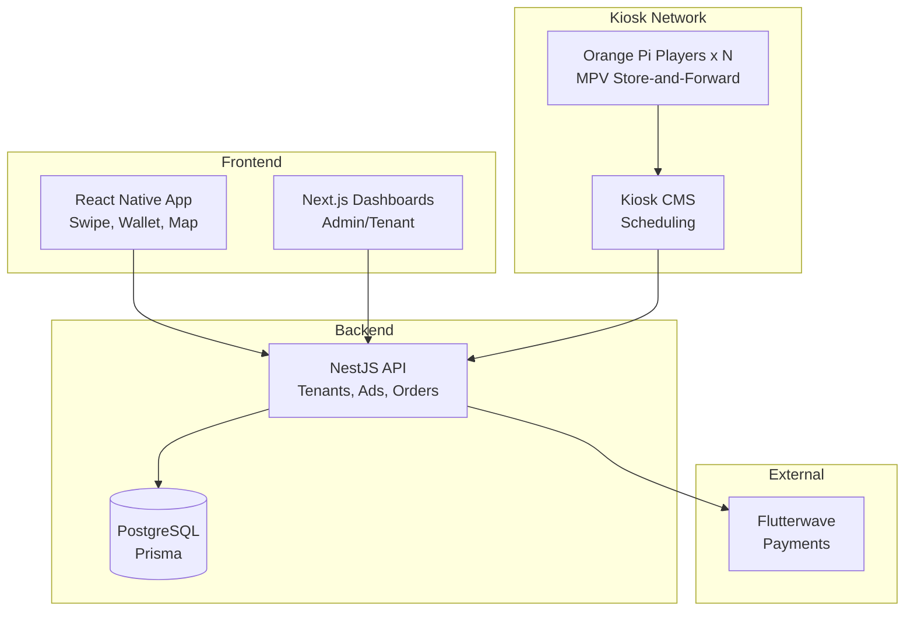
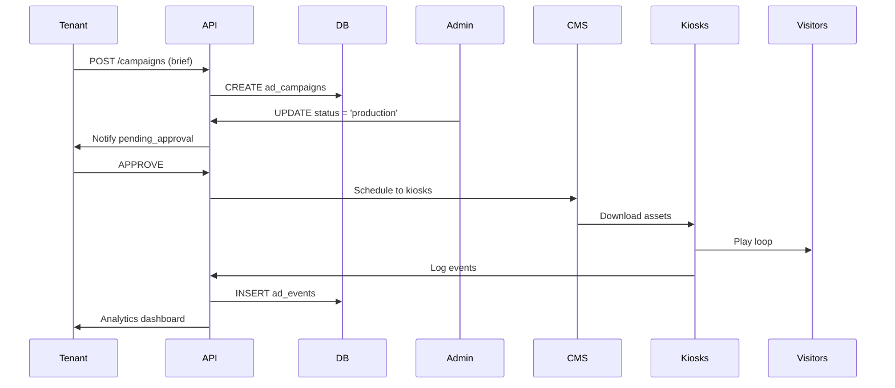

# Bespoke Mall Architecture

## High-Level Overview
Monorepo (TurboRepo):
- `apps/backend`: NestJS API + Prisma PG.
- `apps/web`: Next.js tenant/admin dashboard.
- `apps/mobile`: React Native app (Expo).
- `apps/kiosk-player`: Orange Pi agent (Node/Python).
- `packages/ui`: Shared components (shadcn).

## System Diagram

## Data Flow: Ad Campaign

## Key Decisions (ADRs)
1. **Monorepo**: Turbo for shared deps, CI efficiency.
2. **NestJS**: Modular, typed, enterprise-ready.
3. **Prisma**: Schema-first, migrations, typegen.
4. **Store-and-Forward**: Kiosk reliability.
5. **Flutterwave**: SA payments, splits for commissions.

## Deployment
- Backend: Docker + DO App Platform.
- Web: Vercel.
- Mobile: Expo EAS.
- Kiosks: SD card image.

Scales to 10k users, 50 kiosks.